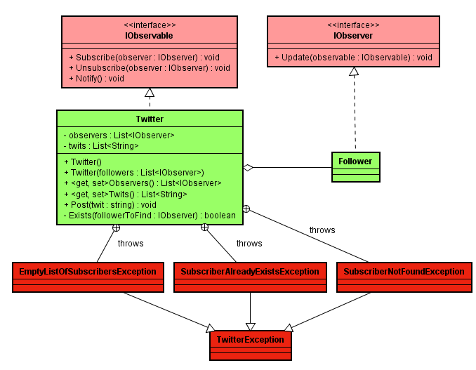

# Labo

## Intention du laboratoire

Ce laboratoire offre la possibilité aux développeur/se-s d'expérimenter différents aspects du développement:

* Lecture d'un diagramme de classes.
* Réécrire du code d'un langage à un autre.
* Lire et réécrire une classes de tests.
* Coder en partant des tests.
* Mise en place d'un git flow simple.
* Traiter une pull request.

### Etapes de réalisation

#### Etape 01 - Réécrire les classes de Java en Php. Le zip livré ci-dessous contient:


Vous n'avez pas besoin de disposer d'un environnement Java !


<figure><figcaption></figcaption></figure>

* L'architecture a déjà été codée. Vous ne devez coder que le corps des méthodes.
* Les signatures des méthodes ne doivent pas être impactées (nom de la méthode, type et nombre des paramètres), néanmoins les conventions de nommage étant différentes entre les deux langages, il vous est demandé de respecter les conventions du langage ciblé (Php).
* Les classes de tests sont présentes et ne doivent en aucun cas être modifiées.



#### Etape 02 - Forker les dépôts Php

Dans cette seconde étape je vous livre ma solution en Php.&#x20;

* Valider votre incrément de l'étape 01 (discussion en classe).
* Forker mon dépôt.
* Exécuter les tests -> ils doivent tous être en échec.
* Metter en place git flow et ouvrer une feature "Twitter".
* Coder pour valider un maximum de tests.
* Refactoriser (soigner votre code).
* Une fois que tous les tests passent, terminer la feature. Vous me livrez sur la branch develop.
* Assigner moi une issue afin que je puisse réaliser un review de votre code. Voici une vidéo qui vous montre comment procéder:



Etape 04 - Traiter la review et améliorer votre solution

Vous recevrez un pull request comparant votre branche develop avec ma branche review.
